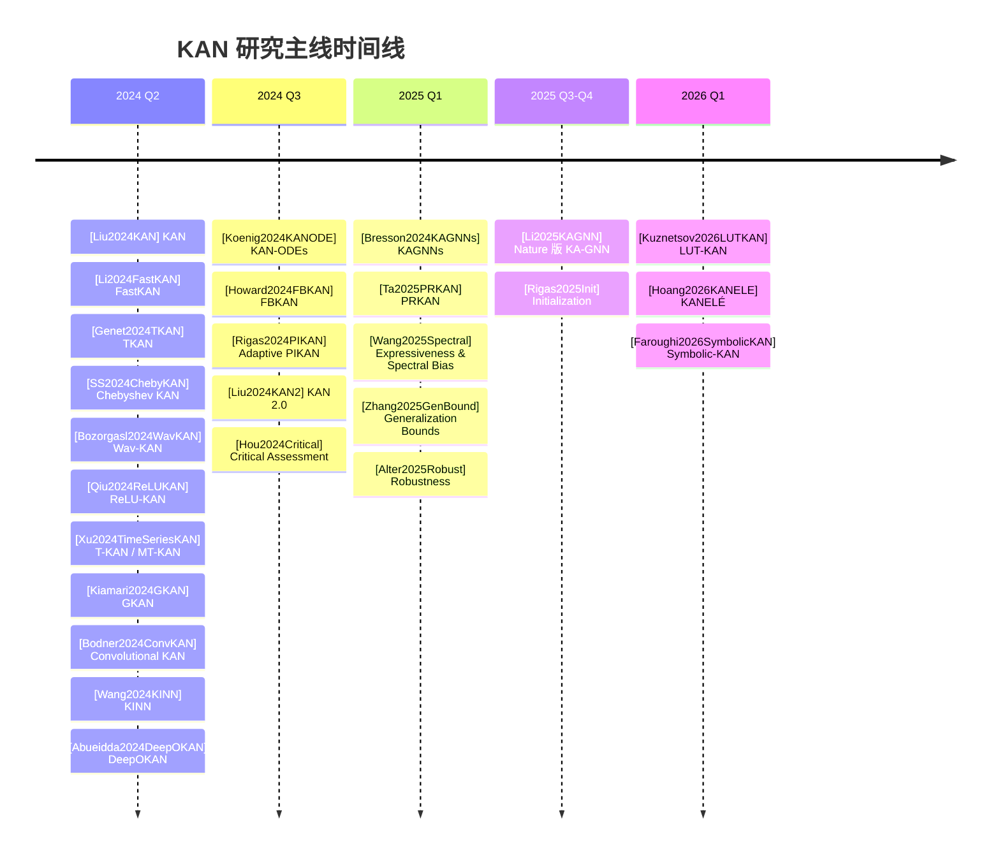
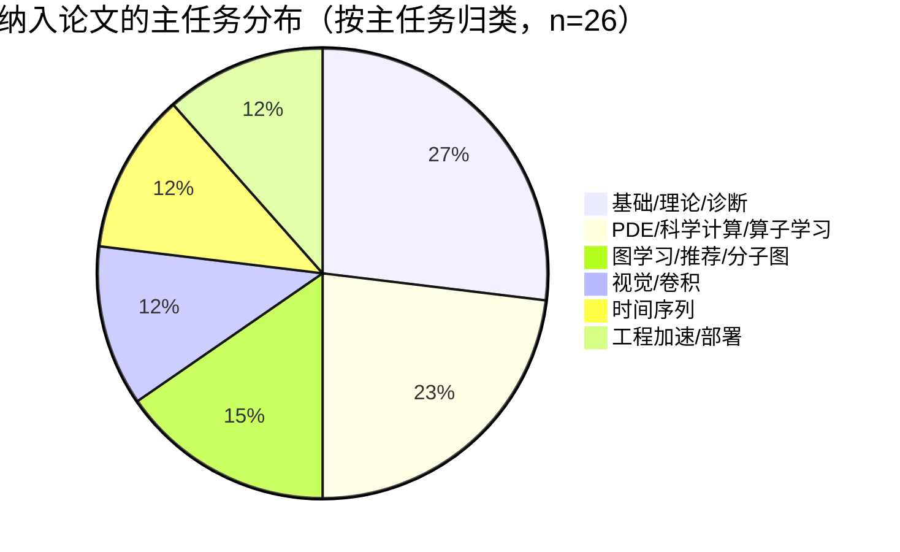
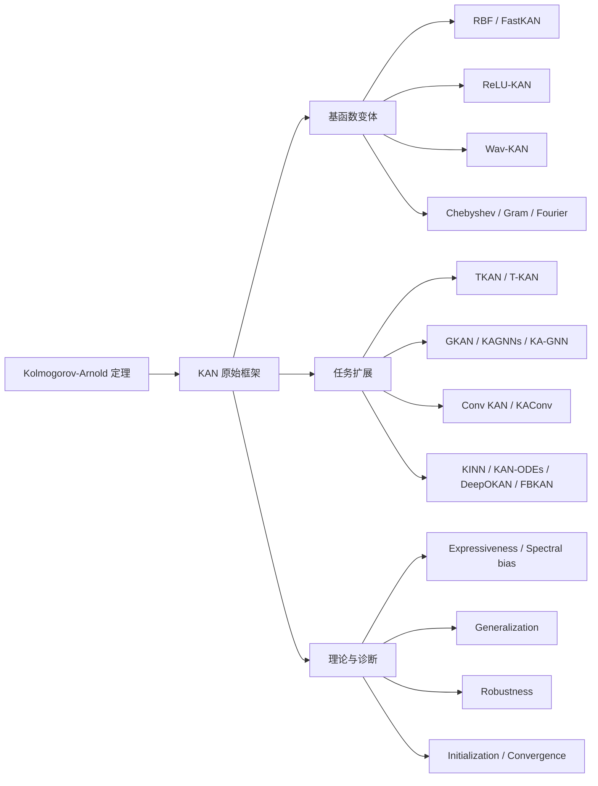

# KAN 系列工作最新研究进展分析报告

## Executive Summary

Kolmogorov–Arnold Network（KAN）在 2024 年由 entity["people","Ziming Liu","mit researcher"] 等提出，其核心变化不是“换一个激活函数”，而是把传统 MLP 的标量权重替换为定义在边上的可学习一元函数：MLP 常写成 $x_{l+1}=\sigma(W_l x_l+b_l)$，而 KAN 更接近 $x_{l+1,j}=\sum_i \phi_{l,ji}(x_{l,i})$。原始论文把 KAN 的卖点概括为三点：对平滑函数/科学计算更强的逼近能力、更好的可视化与符号化解释，以及可通过 grid extension 做多分辨率训练；其 ICLR 2025 会议版本和随后发布的 KAN 2.0 又把“可解释性”从单纯的 symbolic regression 扩展到了“重要特征—模块结构—符号公式”的三级知识抽取框架。citeturn10view0turn11view0turn10view10turn28view1

截至 2026-04-29，KAN 研究已经从“单一 spline-MLP 替代物”迅速分化为三条主线。第一条是**基函数/效率线**：FastKAN、ReLU-KAN、PRKAN、LUT-KAN、KANELÉ 等都在解决 spline 评价慢、显存占用高、难部署到 GPU/FPGA 的工程瓶颈。第二条是**任务扩展线**：时间序列（TKAN、T-KAN/MT-KAN）、图学习（GKAN、KAGNNs、KA-GNN）、视觉卷积（Convolutional KAN、Kolmogorov-Arnold Convolutions）、科学计算/PDE/算子学习（KINN、KAN-ODEs、FBKAN、DeepOKAN）是目前最活跃的落地方向。第三条是**理论与诊断线**：2025 年开始，关于 expressiveness、spectral bias、generalization bounds、robustness、initialization、SGD/GD convergence 的工作出现，说明社区已从“能不能用”进入“为什么有效、何时有效、如何稳定训练”的阶段。citeturn18view0turn19view0turn35search0turn35search1turn35search5turn16view0turn15view5turn25search1turn26view0turn22view1turn22view0turn36search0turn37search2turn38view2turn38view0turn33view0turn33view1turn33view2turn31search0turn34search1

从当前证据看，KAN 并不是“普适优于 MLP”的替代品。支持 KAN 的最好证据集中在**平滑、低到中维、结构化、科学计算友好**的任务中，例如函数拟合、PDE/PINN、机械/物理算子学习、部分时间序列和分子图任务；而在自然图像、离散符号序列、大规模通用表征学习中，证据仍然混合，且显著受限于训练速度、参数膨胀和实现质量。公开的批判性综述明确指出：许多早期“KAN 全面优于 MLP”的叙述，实际只在特定任务、特定平滑先验和特定实现条件下成立；同时，Convolutional KAN 一系论文也承认其在图像分类上常常需要付出 6–8 倍甚至更高训练代价，收益并不总是抵消成本。citeturn30view0turn23view4turn23view3turn24view7turn24view0

对你们的 DG-KAN 路线，我的判断是：最值得押注的不是“router 本身”，而是**KAN 的函数原语可设计性**与**局部函数更新的低内存训练机制**。现有文献真正未被充分解决的难题恰恰在这里：如何把可学习一元函数的表达优势保留下来，同时把反向传播、优化器状态、局部更新、continual learning、部署成本做成工程上可接受的方案。换言之，DG-KAN 若能把“primitive-adjoint co-design + functional-space update + analytic local credit + low-memory sufficient statistics”做到**在同等精度下显著降低峰值显存/优化器状态、并维持收敛与泛化**，其研究价值会比单独做 router 更强，也更符合当前 KAN 文献的真实痛点。这个判断与 FastKAN/ReLU-KAN/PRKAN/LUT-KAN/KANELÉ 的“效率焦虑”、以及 initialization 与 convergence 工作体现出的“训练稳定性焦虑”是高度一致的。citeturn18view0turn19view0turn35search0turn35search1turn35search5turn31search0turn34search1

## 检索范围与文献全景

本次检索以 2024–2026 年为主，因为“Kolmogorov-Arnold Network/KAN”作为现代架构名义上的爆发点始于 2024 年原始论文；为满足“相关工作”与“方法对比”要求，报告额外纳入了 DeepONet 与 Fourier Neural Operator 这两类更早的算子学习基线作为扩展对照，因为很多 KAN 科学计算论文实际是在与这些方法竞争，而不是只与 MLP 竞争。中文原始论文/官方资料极少，因此正文以 arXiv、OpenReview、期刊官网与官方代码页为主。对于看不到完整实验细节（尤其超参、复现脚本、supplementary）的论文，统一标记“未说明”。citeturn10view0turn39search0turn39search1



上图显示：2024 年 Q2 是 KAN 的“变体爆发期”，几乎所有高频名字——FastKAN、TKAN、ReLU-KAN、Wav-KAN、Chebyshev KAN、图 KAN、卷积 KAN、PDE KAN——都在 2–3 个月内出现；2025 年开始则明显转向理论、鲁棒性、初始化与更成熟的图/分子图落地。citeturn10view0turn18view0turn10view4turn10view9turn20view0turn19view0turn15view5turn10view5turn22view1turn38view1turn36search6turn37search2turn38view2turn10view10turn30view0turn25search1turn35search0turn33view0turn33view1turn33view2turn26view0turn31search0turn35search1turn35search5turn5search17



这个分布与 many-to-one 的现实一致：**KAN 最强的落点仍是科学机器学习**，其次才是图学习与时间序列；视觉和通用大模型方向有尝试，但尚未形成像 FNO/DeepONet 那样的清晰主导范式。citeturn38view1turn37search2turn38view0turn26view0turn16view0turn15view5turn22view1turn22view0turn18view0turn19view0turn35search1turn35search5

## 核心论文列表与逐篇要点

### 主线与高影响工作总表

> 说明：下表收录的是截至 2026-04-29 可由原始论文/期刊/官方页面直接核验的**主线与高影响 KAN 工作**。由于 KAN 文献在 2024–2026 爆发式增长，纯短摘要、无法核验的重复版本、仅仓库无论文条目未纳入。对未公开完整训练细节者标“未说明”。

| 标签 | 标题 | 作者 | 年份/来源 | 链接 | 核心贡献与架构要点 | 训练/实验设置 | 主要结果与结论 |
|---|---|---|---|---|---|---|---|
| [Liu2024KAN] | KAN: Kolmogorov-Arnold Networks | Z. Liu et al. | 2024, conference ver. at ICLR 2025 | arXiv:2404.19756；DOI: 10.48550/arXiv.2404.19756 | 用 spline 参数化边函数，提出 deep/wide KAN、grid extension、剪枝与符号化；把“学权重”改为“学边上的 1D 函数”。 | 任务含函数拟合、Poisson PINN、continual learning 与科学发现；PDE 用 interior+boundary loss，并报告 $L^2$ 与 $H^1$；主要与 MLP/LAN/SIREN 比较；原文多处使用 LBFGS，部分附录实验用 Adam。 | 在平滑回归/PDE 上具更陡的 scaling law；Poisson 例子宣称小 KAN 相比大 MLP 约 100 倍更准且 100 倍更省参数；还能剪枝后做 symbolic discovery。 citeturn10view0turn11view0turn13view1turn12view4 |
| [Li2024FastKAN] | Kolmogorov-Arnold Networks are Radial Basis Function Networks | Z. Li | 2024, arXiv | arXiv:2405.06721；DOI: 10.48550/arXiv.2405.06721 | 用 Gaussian RBF 近似 3 阶 B-spline，提出 FastKAN；本质上把 KAN 解释为一类 RBF network。 | MNIST，20 epochs；与 efficient-kan 对比；速度实验在 V100 上，100×100 layer，10 轮×1000 次；未报告复杂超参搜索。 | 前向 3.33× 加速，前反向合计约 1.25×；MNIST 上与 efficient-kan 几乎等价。citeturn18view0 |
| [SS2024ChebyKAN] | Chebyshev Polynomial-Based Kolmogorov-Arnold Networks | S. Sidharth et al. | 2024, arXiv | arXiv:2405.07200；DOI: 10.48550/arXiv.2405.07200 | 以 Chebyshev 多项式替代 spline，强调正交基、递推计算与数值稳定性。 | MNIST；比较不同 degree 与 normalization；Adam, lr=0.01；MNIST 训练 20 epochs，另有 2000 epochs 的函数近似例子；baseline 主要是自身变体。 | degree=3 在 MNIST 最优（97.18%）；standardization 略优于 tanh/min-max；更像“高效 basis 替换”而非新训练范式。citeturn10view9turn21view0turn21view2turn21view4 |
| [Bozorgasl2024WavKAN] | Wav-KAN: Wavelet Kolmogorov-Arnold Networks | Z. Bozorgasl, H. Chen | 2024, arXiv | arXiv:2405.12832；DOI: 10.48550/arXiv.2405.12832 | 用 wavelet 作为边函数基，强调同时表征高频/低频、多分辨与更强鲁棒性。 | MNIST，batch norm 加入 Spl-KAN/Wav-KAN；不同 wavelet（Mexican hat、Morlet、DOG、Shannon），每种 5 次试验，50 epochs；与 Spl-KAN/MLP 比。 | 作者报告 Wav-KAN 在 MNIST 上优于 Spl-KAN，并宣称训练更快；但实验规模仍偏小、通用性证据不足。citeturn20view0 |
| [Qiu2024ReLUKAN] | ReLU-KAN | Q. Qiu et al. | 2024, arXiv | arXiv:2406.02075；DOI: 10.48550/arXiv.2406.02075 | 用 ReLU+点乘构造近似基函数，并把 KAN 运算改写成矩阵/卷积友好的实现。 | 5 组函数速度比较；Adam；训练集 1000，500 次迭代；拟合实验 MSE、1000 iter；另复现“抗灾难遗忘”玩具任务。 | 训练速度相对原 KAN 约 5–20×，深层时接近 20×；拟合更稳；保留原始 KAN 的网格/抗遗忘特性。citeturn19view0 |
| [Genet2024TKAN] | TKAN: Temporal Kolmogorov-Arnold Networks | R. Genet, H. Inzirillo | 2024, arXiv | arXiv:2405.07344；DOI: 10.48550/arXiv.2405.07344 | 把 RKAN 递归层与 LSTM 门控结合，形成时序版 KAN。 | 加密市场小时级 notional trade 数据，2020-01-01 至 2022-12-31；RMSE 训练，评价 $R^2$；Adam，训练集 20% 验证，early stopping+plateau LR decay；baseline 为 GRU/LSTM/last-value。 | 短期与 GRU/LSTM 接近，长期多步预测更稳：15-step 上 TKAN $R^2=0.095$，GRU 为 0.033，LSTM 为 -0.404；方差更小。citeturn10view4turn17view0 |
| [Xu2024TimeSeriesKAN] | Kolmogorov-Arnold Networks for Time Series | K. Xu et al. | 2024, arXiv | arXiv:2406.02496；DOI: 10.48550/arXiv.2406.02496 | 提出 T-KAN（概念漂移/可解释）与 MT-KAN（多变量时序）。 | 股票 OHCLV/波动率预测；输入 84 步预测未来 21 步；T-KAN [84,5,21]，MT-KAN [84×5,5,21×5]；20 iter + prune + 20 iter；指标 MSE/MAE/RMSE；baseline 为 MLP/RNN/LSTM。 | T-KAN 用 193 参数即可接近 LSTM，MT-KAN 以 2132 参数达到最佳 MSE $6.37\times 10^{-5}$；但任务单一，基线较老。citeturn15view5turn15view3 |
| [Kiamari2024GKAN] | GKAN: Graph Kolmogorov-Arnold Networks | M. Kiamari et al. | 2024, arXiv | arXiv:2406.06470；DOI: 10.48550/arXiv.2406.06470 | 将 KAN 用于图上的消息传递与节点更新。 | 公开摘要未完整披露训练细节；作者关注 graph-based learning。 | 作为最早一批图 KAN，证明 KAN 可自然嵌入消息传递框架。citeturn7search2turn10view5 |
| [DeCarlo2024KGNN] | Kolmogorov-Arnold Graph Neural Networks | G. De Carlo et al. | 2024, arXiv / OpenReview | arXiv:2406.18354 | 图消息、聚合和输出层均引入 spline 函数；任务覆盖 node/link/graph。 | Cora、PubMed、CiteSeer、MUTAG、PROTEINS；train/val/test=80/10/10；baseline 为 GCN、GAT、GraphSAGE；超参在 Cora 调优后迁移到其它 citation 图。 | 除 PubMed link prediction 外，作者报告其在各任务上均优于 baseline。citeturn14view0turn14view1 |
| [Bresson2024KAGNNs] | KAGNNs: Kolmogorov-Arnold Networks meet Graph Learning | R. Bresson et al. | 2024 arXiv, 2025 TMLR | arXiv:2406.18380 | 系统比较 KAN 与 MLP 作为 GNN 内部更新模块，提出 KAGCN/KAGAT/KAGIN，并比较 B-spline 与 RBF 版本。 | 节点分类、链接预测、图分类、图回归；详见 TMLR 论文；与对应 MLP-GNN 系统对比。 | 结论是“在所有图任务上与 MLP 持平或更优，但计算更重”，这是图学习中目前最平衡、最可信的一组 KAN 证据。citeturn25search0turn25search1turn25search4 |
| [Xu2024FourierGCF] | FourierKAN-GCF | J. Xu et al. | 2024, arXiv | arXiv:2406.01034 | 在图协同过滤中用 Fourier KAN 替代消息传递中的 MLP feature transform。 | 两个公开推荐数据集；加 message/node dropout；与 现有 GCF SOTA 比。 | 报告优于大多数现有 graph collaborative filtering 方法，说明“频域基函数 KAN”在图推荐中是可行方向。citeturn7search7 |
| [Bodner2024ConvKAN] | Convolutional Kolmogorov-Arnold Networks | A. D. Bodner et al. | 2024, arXiv | arXiv:2406.13155 | 直接把卷积核替换成由 B-spline 参数化的一元函数集合。 | 主要调参与报告基于 Fashion-MNIST；loss 为 categorical cross entropy，作者最终把原 KAN 正则置零；LR/weight decay/batch size网格搜索；baseline 为 CNN、Conv+KAN、KKAN。 | 小/中模型中 KAN conv 有时更省参数且精度略优，但训练慢；作者明确承认图像分类上 MLP after flatten 往往比 dense KAN 更实用。citeturn22view1turn23view0turn23view2turn23view3turn23view4 |
| [Drokin2024KAConv] | Kolmogorov-Arnold Convolutions: Design Principles and Empirical Studies | I. Drokin | 2024, arXiv | arXiv:2407.01092；DOI: 10.48550/arXiv.2407.01092 | 目前最系统的卷积 KAN 设计指南：比较 spline/RBF/wavelet/polynomial/Gram，提出 bottleneck KAN conv、KAN attention/focal modulation、PEFT、MoE router。 | MNIST/CIFAR10/CIFAR100/Tiny-ImageNet/ImageNet1k/HAM10000/BUSI/GlaS/CVC；分类用 cross-entropy，分割用 BCE+Dice；ImageNet/HAM 用 AdamW；有 regularization 与 bottleneck ablation。 | Gram/wavelet 变体整体更优；按钮式 bottleneck 有助参数控制；在医学分割上表现最好，但在通用小图像分类中并非持续优于常规 conv。router/MoE 只出现在 bottleneck conv 的局部模块里，不是主流 KAN 总框架。citeturn22view0turn24view1turn24view4turn24view6turn24view8 |
| [Wang2024KINN] | Kolmogorov–Arnold-Informed Neural Network | Y. Wang et al. | 2024 arXiv, 2025 CMA | arXiv:2406.11045；DOI: 10.1016/j.cma.2024.117518 | 把 KAN 带入 PINN/深能量法，系统比较不同 PDE 形式下的 KAN 与 MLP。 | 多尺度、奇异、应力集中、非线性超弹性、非均质、复杂几何 PDE；前向与逆问题；与 MLP-PINN/DEM 对比。 | 在大多数 solid mechanics 问题上显著优于 MLP，唯复杂几何问题表现不佳；说明 KAN 的 smooth prior 在结构力学中较匹配。citeturn36search0turn38view1turn36search13 |
| [Koenig2024KANODE] | KAN-ODEs | B. C. Koenig et al. | 2024 arXiv, 2024 CMA | arXiv:2407.04192；DOI: 10.1016/j.cma.2024.117397 | 把 KAN 作为 Neural ODE 向量场近似器，并用 adjoint sensitivity 训练。 | Lotka–Volterra、波传播/激波、复 Schrödinger、Allen-Cahn、Fisher-KPP；MSE 损失；adjoint sensitivity；与同规模 Neural ODE 对比。 | 240 参数 KAN-ODE 每 epoch 慢 2.5–3×，但收敛所需 epoch 约少 10×，整体有效加速 3–4×；并能符号化 hidden physics。citeturn14view3turn14view2turn13view4turn37search6 |
| [Rigas2024PIKAN] | Adaptive Training of Grid-Dependent Physics-Informed KANs | S. Rigas et al. | 2024 arXiv, 2024 IEEE Access | arXiv:2407.17611；DOI: 10.1109/ACCESS.2024.3504962 | 针对 physics-informed KAN 训练慢与 grid extension 峰值不稳定，提出 JAX 实现、adaptive state transition 与 alternative basis。 | PDE 求解；与原始 KAN 实现及更大参数模型比较。 | 报告相对原始 KAN 实现最高 84× 训练加速，且 $L^2$ 误差可再降 43.02%；是“训练工程化”最直接的证据之一。citeturn36search3turn36search11 |
| [Howard2024FBKAN] | Finite Basis Kolmogorov-Arnold Networks | A. A. Howard et al. | 2024, arXiv | arXiv:2406.19662 | 受 FBPINNs 启发，用域分解把几个小 KAN 包装成并行 FBKAN，缓解 KAN 训练昂贵问题。 | 数据驱动与 physics-informed 两类；噪声数据与多尺度问题；附录列训练参数。 | FBKAN 在 noisy/multiscale/PINN 场景下比单体 KAN 更准确、更可扩展，说明“域分解+小 KAN 组合”是值得跟进的训练思路。citeturn38view2turn36search4 |
| [Abueidda2024DeepOKAN] | DeepOKAN | D. W. Abueidda et al. | 2024 arXiv, 2025 CMA | arXiv:2405.19143；DOI: 10.1016/j.cma.2024.117699 | 用 KAN 替换 DeepONet 中的传统网络模块，做 mechanics operator learning。 | 1D sinusoidal wave、2D orthotropic elasticity、2D transient Poisson；与 DeepONet 对比。 | 在这些 mechanics operator 任务上训练 loss 更低、预测更准确；说明 KAN 更像“operator architecture 中的局部近似器增强器”，而非独立替代所有 operator inductive bias。citeturn38view0turn37search4 |
| [Liu2024KAN2] | KAN 2.0: KANs Meet Science | Z. Liu et al. | 2024, arXiv | arXiv:2408.10205；DOI: 10.48550/arXiv.2408.10205 | 引入 MultKAN、kanpiler、tree converter，把知识嵌入/抽取分成特征、模块、符号三层。 | 侧重科学发现任务：守恒量、对称性、Lagrangian、constitutive law 等；实验多为 case study。 | 研究重心从“换网络”转向“网络—科学知识双向接口”；对你们强调 interpretability/functional co-design 的路线很有启发。citeturn10view10turn28view1turn28view2 |
| [Hou2024Critical] | A Critical Assessment of Claims, Performance, and Practical Viability | Y. Hou et al. | 2024, arXiv | arXiv:2407.11075 | 批判性综述，强调原 theorem 与实际 KAN 的差异，并用系统评测指出 KAN 成功高度依赖数据-平滑性匹配。 | 横跨数学函数、时序、医学影像、自然图像、文本、音频等。 | 其核心观点是：KAN 的价值主要在“task-basis alignment”，不是普适替代 MLP；在自然图像/文本等高频、离散域中往往吃亏。citeturn30view0 |
| [Wang2025Spectral] | On the expressiveness and spectral bias of KANs | Y. Wang et al. | 2025, ICLR Poster | OpenReview | 证明 MLP 可被同规模 KAN 表示；反向把 KAN 映射为 MLP 时参数会乘以 grid size，并分析 spectral bias。 | 理论 + 不同 depth/width/grid 的经验比较。 | 结论是：KAN 至少不弱于 MLP 的表示力，且比 MLP 更不偏低频；grid extension 有助高频学习。citeturn33view0 |
| [Zhang2025GenBound] | Generalization Bounds and Model Complexity for KANs | X. Zhang, H. Zhou | 2025, ICLR Poster | OpenReview | 给出 basis-combination 与低秩 RKHS 两类 KAN 的泛化界。 | 理论为主，并在 simulated/real data 上做数值验证。 | 重要结论是：界主要随层的 $l_1$ 范数、Lipschitz 常数、秩等变化，除对数项外不显式依赖节点数。citeturn33view1 |
| [Alter2025Robust] | On the Robustness of KANs: An Adversarial Perspective | T. Alter et al. | 2025, TMLR | OpenReview/TMLR | 首个系统性 KAN 对抗鲁棒性评测。 | MNIST、FashionMNIST、KMNIST、CIFAR-10、SVHN、ImageNet 子集；白盒/黑盒/AutoAttack；含对抗训练与 knots/order ablation。 | 小中型 KAN 不一定更鲁棒，但大模型更有韧性；鲁棒性对 knots/order 很敏感。citeturn33view2 |
| [Rigas2025Init] | Initialization Schemes for KANs: An Empirical Study | S. Rigas et al. | 2025 arXiv, ICLR 2026 Poster | arXiv:2509.03417 | 系统研究初始化，提出 LeCun-/Glorot-inspired 与经验 power-law 初始化，并用 NTK 分析训练动态。 | 大规模 grid search，函数拟合、forward PDE、Feynman 子集。 | Glorot 型在大模型上显著优于默认初始化，而 power-law 整体最稳、跨任务最好。citeturn31search0turn31academia15 |
| [Ta2025PRKAN] | PRKAN: Parameter-Reduced KANs | H.-T. Ta et al. | 2025, arXiv | arXiv:2501.07032 | 通过参数约简、注意力、GRBF 与 LN 减小 KAN 层参数，使其更接近 MLP。 | MNIST、Fashion-MNIST；与多种 KAN、MLP 比较。 | 比多种现有 KAN 更强，注意力版接近 MLP，但训练时间仍偏长。citeturn35search0 |
| [Li2025KAGNN] | Kolmogorov–Arnold graph neural networks for molecular property prediction | L. Li et al. | 2025, Nature Machine Intelligence | DOI: 10.1038/s42256-025-01087-7 | 把 Fourier-based KAN 融入 node embedding、message passing、readout，形成 KA-GCN/KA-GAT。 | 7 个 MoleculeNet 分子性质数据集；与 AttentiveFP、D-MPNN、MolCLR、Uni-Mol、SMPT 以及其他 KAN-GNN 比较；超参细节在补充。 | 声称在七个分子基准上达到 SOTA；在 BBBP 上 KA-GCN/KA-GAT 的 AUC 提升约 7.95%/7.68%。citeturn26view0turn27view2turn27view7 |
| [Kuznetsov2026LUTKAN] | LUT-KAN: Segment-wise LUT Quantization for Fast KAN Inference | O. Kuznetsov | 2026, arXiv | arXiv:2601.03332 | 用分段查找表编译 spline edge functions，并做 int8/uint8 量化，给出可重现实验协议。 | sweeps over LUT resolution $L\in\{16,32,64,128\}$；统计精度/速度/内存/OOB robustness；DoS 检测案例。 | 分类质量几乎不掉（F1 降 < 0.0002），CPU 推理延迟 10–12× 降低，但内存开销约增至 10×（$L=64$）。citeturn35search1turn35search4 |
| [Hoang2026KANELE] | KANELÉ: KANs for Efficient LUT-based Evaluation | D. Hoang et al. | 2026, FPGA 2026 | DOI: 10.1145/3748173.3779202 | 面向 FPGA 的 LUT 化 KAN 推理框架，抓住 edge-function 可预编译的结构优势。 | 官方 GitHub 与 ACM 页面公开；完整实验细节需论文正文。 | 说明 KAN 并非只能“更慢”，在合适的 LUT 编译/硬件路径上反而有部署优势。citeturn35search5turn35search8 |
| [Faroughi2026SymbolicKAN] | Symbolic-KAN | S. A. Faroughi et al. | 2026, arXiv | arXiv:2603.23854 | 引入离散符号结构约束，继续推进“可解释/可符号化学习”的 KAN 路线。 | 公开摘要可见，完整实验超参需查看论文正文。 | 表明 KAN 社区在 2026 年仍把“连续函数学习 + 离散符号结构”耦合作为重要方向。citeturn5search17 |

### 代表性结果比较表

| 方向 | 代表论文 | 代表数字 | 解读 |
|---|---|---:|---|
| 平滑函数/PDE 精度 | [Liu2024KAN] | 小 KAN vs 大 MLP 在 Poisson 例子中约 100× 更高精度、100× 参数效率 | KAN 在平滑科学计算中确有强证据，但高度依赖 problem smoothness。 citeturn13view1 |
| 工程前向速度 | [Li2024FastKAN] | 3.33× 前向加速 | 用 RBF 替代 spline 是高价值路线。 citeturn18view0 |
| 工程训练速度 | [Qiu2024ReLUKAN] | 5–20× 训练加速 | 矩阵化/卷积化实现非常关键。 citeturn19view0 |
| PINN 工程化 | [Rigas2024PIKAN] | 最高 84× 训练加速；$L^2$ 误差最多再降 43.02% | 训练策略和实现可决定 KAN 是否“可用”。 citeturn36search3turn36search11 |
| Neural ODE | [Koenig2024KANODE] | 每 epoch 慢 2.5–3×，但整体有效 3–4× 更快到达同等性能 | 局部 step 代价上升不代表总训练更慢。 citeturn14view2 |
| 多步时序 | [Genet2024TKAN] | 15 步预测 $R^2$: TKAN 0.095 vs GRU 0.033 vs LSTM -0.404 | KAN+memory 在长时域预测上有潜力。 citeturn17view0 |
| 图学习 | [Bresson2024KAGNNs] | “on-par or better than MLPs on all tasks studied” | 图学习是 KAN 除 SciML 外最有希望的方向之一。 citeturn25search0 |
| 分子图 | [Li2025KAGNN] | BBBP AUC 提升约 7.95% / 7.68% | Fourier-based KAN 在分子图上给出了目前最强落地证据。 citeturn27view2turn27view7 |
| CPU 部署 | [Kuznetsov2026LUTKAN] | 10–12× CPU 延迟降低，F1 几乎不变 | KAN 部署问题开始得到真正工程级解决。 citeturn35search1turn35search4 |

```text
关键工程速度改进（论文报告值，非统一硬件/任务，仅作趋势图）
Adaptive PIKAN   84x  ████████████████████████████████████████████████████████████████████████████
ReLU-KAN         20x  ████████████████████
LUT-KAN          12x  ████████████
FastKAN         3.3x  ███
```

上面的“条形图”虽然不可直接横向比较绝对公平，但它清楚说明：**2025–2026 的 KAN 研究重点已经不是再证明一次“KAN 比 MLP 准”，而是在解决“怎么把 KAN 训练/推理做快、做稳、做可部署”**。citeturn18view0turn19view0turn36search3turn35search1

## 研究趋势归纳与方法比较

### 常见任务、数据集与指标

| 任务类型 | 代表论文 | 常见数据集 | 常见指标 |
|---|---|---|---|
| 数学函数拟合/符号发现 | [Liu2024KAN], [Liu2024KAN2], [Wang2025Spectral] | 合成函数、Feynman 子集 | RMSE、MSE、拟合曲线、symbolic match、attribution/sparsity citeturn11view0turn10view10turn33view0 |
| PDE / PINN / 科学计算 | [Wang2024KINN], [Koenig2024KANODE], [Rigas2024PIKAN], [Howard2024FBKAN] | Poisson、Allen–Cahn、Fisher-KPP、Schrödinger、solid mechanics | relative $L^2$、$H^1$、energy norm、PDE residual、收敛 epoch、wall-clock citeturn13view1turn14view3turn36search0turn36search3turn38view2 |
| 算子学习 | [Abueidda2024DeepOKAN]，对照 DeepONet/FNO | mechanics operators、Darcy/Burgers/Navier–Stokes（对照文献） | operator error、relative $L^2$、推理速度、分辨率泛化 citeturn38view0turn39search0turn39search1 |
| 时间序列 | [Genet2024TKAN], [Xu2024TimeSeriesKAN] | 金融 OHCLV/隐含波动率、加密市场交易量 | MSE、MAE、RMSE、$R^2$、长步预测稳定性 citeturn17view0turn15view5 |
| 图学习/推荐 | [Kiamari2024GKAN], [DeCarlo2024KGNN], [Bresson2024KAGNNs], [Xu2024FourierGCF], [Li2025KAGNN] | Cora/PubMed/CiteSeer、MUTAG/PROTEINS、MoleculeNet、推荐数据集 | Accuracy、ROC-AUC、RMSE、Hits/NDCG（推荐） citeturn14view0turn25search0turn7search7turn27view2 |
| 图像/分割 | [Bodner2024ConvKAN], [Drokin2024KAConv], [Alter2025Robust] | Fashion-MNIST、MNIST、CIFAR10/100、Tiny-ImageNet、ImageNet1k、HAM10000、BUSI/GlaS/CVC | Accuracy、Precision、Recall、F1、Dice、对抗 robust accuracy citeturn23view0turn24view1turn24view4turn33view2 |
| 工程/部署 | [Li2024FastKAN], [Qiu2024ReLUKAN], [Kuznetsov2026LUTKAN], [Hoang2026KANELE] | MNIST、分类案例、边缘/FPGA case study | training time、eval time、latency、peak memory、artifact size、speedup citeturn18view0turn19view0turn35search1turn35search5 |

从任务分布可以看出，KAN 文献最一致的“成功故事”发生在**回归 / PDE / operator / 分子图**这几类本身就带有平滑结构、低噪声、可微先验、较强物理归纳偏置的场景里；而自然图像分类、通用 CV/NLP 虽有探索，但更像“可行性验证”，离稳固范式还有距离。citeturn36search0turn37search2turn38view0turn26view0turn23view4turn30view0

### 常见改进方向

第一类改进是**基函数替换**。FastKAN 用 RBF，Wav-KAN 用 wavelet，ChebyKAN 用 Chebyshev，多项式/Gram/Fourier 变体则更多出现在卷积版或图版中。它们的共同逻辑是：原始 spline 虽灵活，但局部基函数评价贵、训练和部署不友好，所以变体都在追求“近似保留函数空间表达力，但换成更好算的基”。citeturn18view0turn20view0turn21view5turn22view0turn27view2

第二类改进是**训练工程化**。grid extension 是原始 KAN 的多分辨率训练技巧；PIKAN 针对其不稳定峰值提出 adaptive state transition；Initialization 论文显示默认初始化远非最优，power-law/Glorot 风格更稳；SGD/GD convergence 工作则开始从 NTK 角度解释两层 KAN 的训练可收敛性。说明 KAN 研究正在从“换表示”走向“换优化接口”。citeturn12view4turn36search3turn31search0turn34search1

第三类改进是**任务结构化扩展**。TKAN 把 KAN 嵌进记忆/门控单元；KAGNNs 把 KAN 作为消息传递中替代 MLP 的局部变换器；DeepOKAN 把 KAN 放进 operator learning；KANELÉ/LUT-KAN 则把 edge functions 编译到查找表和硬件路径。它们共同说明：KAN 更像一种**可插拔的一元函数原语层**，比“完整 end-to-end 架构范式”更容易成为复杂系统中的一个组件。citeturn17view0turn25search0turn38view0turn35search1turn35search5

第四类改进是**解释性增强**。KAN 2.0、Symbolic-KAN 以及原始 KAN 的剪枝/suggest_symbolic/kanpiler 路线，说明 KAN 社区把解释性理解为“人能介入函数层面的调试与假设检验”，而不是单纯后验 saliency。这个方向在 AI for Science 中很强，但在通用数据任务里尚不意味着更高精度。citeturn28view1turn5search17turn11view0

关于你特别提到的 **functional update、Sobolev、adjoint、router**：  
其一，**functional update** 在 KAN 中是“内生的”——因为参数本就定义边函数——但明确把优化器写成“函数空间更新规则”的论文还不多，这反而给 DG-KAN 留出了原创空间。其二，**Sobolev** 更多体现在 PDE/科学计算里作为 $H^1$、energy norm、physics loss，而不是一个单独的 KAN 变体家族。其三，**adjoint** 在 KAN-ODEs 里已经是明确成功例子，说明“用 KAN 做动力系统 + 伴随法训练”是有坚实先例的。其四，**router** 在我检索到的主线文献里并不是第一性方向，最明确的出现是在 Kolmogorov-Arnold Convolutions 的 bottleneck MoE 局部模块中，而不是整个 KAN 生态的中心主张。citeturn13view1turn14view3turn22view0

### KAN 与 MLP、FourierNet、DeepONet、Neural Operator 的比较



与 **MLP** 相比，KAN 的优势不是“理论上更通用”，而是当目标函数本身具有平滑、可分解、低维局部结构时，KAN 更容易把计算预算花在“一元函数形状”上，而不是靠更宽更深网络去间接逼近；但代价是每条边都变成函数原语，导致训练和部署在工程上更难。理论上，已有工作证明 MLP 可被同级别 KAN 表示，而把 KAN 改写为 MLP 时参数会乘上 grid size；经验上，批判性评估又指出 KAN 成功高度取决于平滑先验与任务匹配。简言之：**KAN 更像 task-aligned specialist，MLP 更像 generic workhorse**。citeturn33view0turn30view0

与 **FourierNet / 频域基网络** 相比，KAN 的优势在于局部函数可解释性、可剪枝、可符号化，以及不需要全局周期先验；而 Fourier/正弦基网络更适合高频、周期性或需要快速传播高频信息的场景。原始 KAN 与批判性综述都讨论了 smoothness prior 的重要性，而 FourierNet 一类工作之所以常被看作高频友好，是因为其核心过滤器就是正弦/频域基。对你们而言，这意味着：如果 DG-KAN 的目标任务包含明显高频成分，**basis choice 不应被固定为 spline**，至少要把 Fourier/RBF 作为并列 primitive。citeturn30view0turn39search3turn39search6

与 **DeepONet** 相比，KAN 不自带 operator learning 的 branch/trunk 结构归纳偏置。DeepONet 的基本设计是 branch net 编码输入函数、trunk net 编码输出坐标，它的目标是学习“函数到函数”的算子，而不是单一函数近似，因此在 PDE 家族映射、边界条件到解场的任务上天然更契合。DeepOKAN 的意义恰好说明了这一点：文献最成功的做法不是“用 KAN 替代 DeepONet”，而是“把 KAN 塞进 DeepONet 风格 operator 架构，提升局部近似能力”。所以对于算子学习任务，KAN 更现实的角色是**构件增强器**。citeturn39search0turn39search2turn38view0

与 **Fourier Neural Operator / Neural Operator** 相比，KAN 的优势是可解释、局部函数可视化和在小样本/平滑/物理可解释任务上的定制能力；FNO 的优势是对规则网格 PDE 家族的可扩展性、分辨率不变性与大规模算子学习生态。FNO 官方结果强调其在 Burgers、Darcy、Navier–Stokes 上的训练效率与 zero-shot super-resolution 能力；这类结果并不是 KAN 目前主线论文能普遍匹敌的。因此科学计算上更准确的表述不是“KAN 会替代 Neural Operator”，而是：**在 operator skeleton 已确定时，KAN 可作为局部非线性层提升精度/解释性；在需要大规模分辨率泛化时，Neural Operator 仍更成熟。**citeturn39search1

## 开放问题与对 DG-KAN 路线的具体建议

### 仍未解决的关键问题

第一，**理论来源与实践形式之间仍有缺口**。批判性评估指出，今天的深层 KAN 与 Kolmogorov-Arnold 定理所要求的精确结构并不一致；KAN 成功更像“从该定理获得灵感的函数原语工程”，而不是定理直接落地。这并不削弱 KAN 的价值，但意味着任何新工作都不应再把“定理背书”当作主要贡献点，而要把贡献落在可检验的优化、泛化、部署与解释性上。citeturn30view0

第二，**计算/显存成本是第一工程瓶颈**。FastKAN、ReLU-KAN、PRKAN、PIKAN、LUT-KAN、KANELÉ 的共同存在本身就说明：社区已用大量精力在“把 KAN 做得像普通层一样可训练/可部署”。因此，任何新的 KAN 论文若无法给出至少一项明确的工程收益（训练时间、峰值显存、优化器状态、推理延迟、部署可行性），都很难在 2026 年以后显得足够有说服力。citeturn18view0turn19view0turn35search0turn36search3turn35search1turn35search5

第三，**泛化与抗遗忘仍缺硬证据**。原始 KAN 和 ReLU-KAN 都展示了 toy continual-learning 式的“避免灾难遗忘”，但尚缺在标准持续学习基准上的系统评测；generalization bounds、robustness 论文则提供了理论与安全角度的补强，却还不足以让人断言“KAN 天生更泛化”或“天生更安全”。因此“快收敛、不易过拟合、抗遗忘”可以作为研究假设，但现在仍需要更规范的证明。citeturn13view0turn19view0turn33view1turn33view2

第四，**解释性不等于自动可懂**。KAN 的真正优势不是“自带解释”，而是“更容易人为介入”：可画边函数、可剪枝、可符号拟合、可注入先验。但在高维视觉/图任务里，这种可视化并不会自动变成科学解释；KAN 2.0 的贡献恰恰是把解释性链路细化成可操作工具，而不是空泛口号。citeturn28view1turn11view0

### 对 DG-KAN 的具体建议

如果把你们当前路线概括为“**KAN primitive-adjoint co-design + functional-space update + analytic local credit + low-memory sufficient statistics**”，那么最应该优先验证的不是 router，而是以下三件事。

第一，**先证明“低内存局部函数更新”本身有硬价值**。现有文献对 KAN 的最大抱怨就是慢、吃显存、难部署；而几乎没有工作直接针对“反向时是否必须保留完整中间态 / 是否能用局部 sufficient statistics 重建函数梯度”做系统研究。因此 DG-KAN 的第一目标应是：在原始 KAN/FastKAN/ReLU-KAN/PRKAN 同等误差下，把**峰值显存**与**优化器状态开销**明显压下来。建议至少把以下门槛设为“过线标准”：  
1. 同等测试误差下，峰值显存降低 $\ge 40\%$；  
2. 或同等显存下，达到目标误差所需 wall-clock 降低 $\ge 1.5\times$；  
3. 或 analytic local credit 相对全量 BP 的性能差距控制在 $1\%\sim 2\%$ 以内。  
这比单独证明“router 有用”更容易击中文献真痛点。相关判断直接受现有效率文献启发。citeturn18view0turn19view0turn36search3turn35search1turn35search5

第二，**请把 baseline 设计成“两层对照”而不是“一层对照”**。  
一层是“同家族对照”：PyKAN / efficient-kan、FastKAN、ReLU-KAN、PRKAN。这样你能回答“你们是比传统 KAN 训练法更好，还是只是比最慢实现更好”。  
另一层是“任务归纳偏置对照”：  
- 若做函数拟合 / symbolic discovery：MLP、SIREN/频域基网络；  
- 若做 PDE / operator：MLP-PINN、DeepONet、FNO/Neural Operator、Neural ODE；  
- 若做图任务：GCN/GAT/GIN + KAGNNs。  
否则很容易陷入“比 MLP 强，但其实输给标准 operator model”的尴尬。DeepOKAN、KAN-ODEs、KA-GNN 这些工作都在提醒我们：**KAN 构件优势不等于整体架构优势**。citeturn38view0turn37search2turn25search0turn39search0turn39search1

第三，**把实验优先级按“最能体现 DG-KAN 独特性”的顺序排**。  
最优先的是**平滑函数/科学回归 + 小数据 PDE/动力系统**。这类任务最适合证明 functional-space update、analytic local credit 与 symbolic/extrapolation 能力。  
第二优先是**continual learning / task sequence**，因为 KAN 文献已经有抗遗忘的初步 narrative，但缺严谨 benchmark；DG-KAN 若在这上面拿出强结果，会非常有辨识度。  
第三优先才是**高维视觉/大规模图像分类**。原因不是不能做，而是该方向当前对 KAN 并不友好，容易把你们的研究资源消耗在 kernel engineering 上，而不是核心训练思想上。这个排序与 critical assessment、conv-KAN 文献和 KINN/DeepOKAN 的正反证据是一致的。citeturn30view0turn23view4turn36search0turn38view0

具体到评价指标，我建议 DG-KAN 必须至少同步报告五类数值：  
1. **精度**：task metric（MSE/MAE/$L^2$/$H^1$/AUC/Accuracy）；  
2. **效率**：wall-clock、steps-to-threshold、throughput；  
3. **内存**：peak GPU memory、参数量、优化器状态 bytes/param；  
4. **学习动态**：训练/验证曲线、AULC（learning curve area）、是否出现 grid/credit collapse；  
5. **持续学习/稳定性**：forgetting、BWT/FWT、seed 方差。  
如果你们要强调“函数空间更新”的解释性，还应再加两项：edge function smoothness/sparsity、symbolic fit 的 $R^2$ 或替代表达复杂度。这样你的论证链条才是闭合的。相关 metric 选择基本覆盖了现有 KAN 主线论文的共识。citeturn13view1turn14view3turn17view0turn33view2turn35search1

最后给一个更直接的研究判断：**router 可以做，但不该是第一贡献**。本次检索中，router 的明确信息主要出现在卷积 KAN 的 bottleneck MoE 里，用来控制局部专家选择；它不是 KAN 文献的中心矛盾。相反，**内存、局部 credit、初始化、基函数选择、可部署性**才是整个 KAN 社区共同承认的问题。所以 DG-KAN 最优叙述方式，不应是“我们给 KAN 加了个 router”，而应是“我们提出了一种面向函数参数化网络的低内存局部训练机制，并在 KAN 家族上验证其优于标准全量反传”。如果实验再证明它对 continual learning 和 operator learning 也有收益，叙事会比 router-only 强很多。citeturn22view0turn31search0turn35search1

## 可直接复制的参考文献条目

```bibtex
@inproceedings{Liu2025KAN,
  title     = {KAN: Kolmogorov-Arnold Networks},
  author    = {Liu, Ziming and Wang, Yixuan and Vaidya, Sachin and Ruehle, Fabian and Halverson, James and Soljacic, Marin and Hou, Thomas Y. and Tegmark, Max},
  booktitle = {International Conference on Learning Representations},
  year      = {2025},
  eprint    = {2404.19756},
  archivePrefix = {arXiv},
  doi       = {10.48550/arXiv.2404.19756}
}

@article{Li2024FastKAN,
  title     = {Kolmogorov-Arnold Networks are Radial Basis Function Networks},
  author    = {Li, Ziyao},
  journal   = {arXiv preprint arXiv:2405.06721},
  year      = {2024},
  doi       = {10.48550/arXiv.2405.06721}
}

@article{Qiu2024ReLUKAN,
  title     = {ReLU-KAN: New Kolmogorov-Arnold Networks that Only Need Matrix Addition, Dot Multiplication, and ReLU},
  author    = {Qiu, Qi and Zhu, Tao and Gong, Helin and Chen, Liming and Ning, Huansheng},
  journal   = {arXiv preprint arXiv:2406.02075},
  year      = {2024},
  doi       = {10.48550/arXiv.2406.02075}
}

@article{Genet2024TKAN,
  title     = {TKAN: Temporal Kolmogorov-Arnold Networks},
  author    = {Genet, Remi and Inzirillo, Hugo},
  journal   = {arXiv preprint arXiv:2405.07344},
  year      = {2024},
  doi       = {10.48550/arXiv.2405.07344}
}

@article{Koenig2024KANODE,
  title     = {KAN-ODEs: Kolmogorov-Arnold Network Ordinary Differential Equations for Learning Dynamical Systems and Hidden Physics},
  author    = {Koenig, Benjamin C. and Kim, Suyong and Deng, Sili},
  journal   = {Computer Methods in Applied Mechanics and Engineering},
  volume    = {432},
  pages     = {117397},
  year      = {2024},
  doi       = {10.1016/j.cma.2024.117397}
}

@article{Wang2025KINN,
  title     = {Kolmogorov-Arnold-Informed Neural Network: A Physics-Informed Deep Learning Framework for Solving Forward and Inverse Problems Based on Kolmogorov-Arnold Networks},
  author    = {Wang, Yizheng and Sun, Jia and Bai, Jinshuai and Anitescu, Cosmin and Eshaghi, Mohammad Sadegh and Zhuang, Xiaoying and Rabczuk, Timon and Liu, Yinghua},
  journal   = {Computer Methods in Applied Mechanics and Engineering},
  volume    = {433},
  pages     = {117518},
  year      = {2025},
  doi       = {10.1016/j.cma.2024.117518}
}

@article{Abueidda2025DeepOKAN,
  title     = {DeepOKAN: Deep Operator Network Based on Kolmogorov Arnold Networks for Mechanics Problems},
  author    = {Abueidda, Diab W. and Pantidis, Panos and Mobasher, Mostafa E.},
  journal   = {Computer Methods in Applied Mechanics and Engineering},
  volume    = {436},
  pages     = {117699},
  year      = {2025},
  doi       = {10.1016/j.cma.2024.117699}
}

@article{Bresson2025KAGNNs,
  title     = {KAGNNs: Kolmogorov-Arnold Networks Meet Graph Learning},
  author    = {Bresson, Roman and Nikolentzos, Giannis and Panagopoulos, George and Chatzianastasis, Michail and Pang, Jun and Vazirgiannis, Michalis},
  journal   = {Transactions on Machine Learning Research},
  year      = {2025},
  eprint    = {2406.18380},
  archivePrefix = {arXiv}
}

@article{Li2025KAGNNNature,
  title     = {Kolmogorov-Arnold Graph Neural Networks for Molecular Property Prediction},
  author    = {Li, Longlong and Zhang, Yipeng and Wang, Guanghui and others and Xia, Kelin},
  journal   = {Nature Machine Intelligence},
  volume    = {7},
  pages     = {1346--1354},
  year      = {2025},
  doi       = {10.1038/s42256-025-01087-7}
}

@inproceedings{Wang2025Spectral,
  title     = {On the Expressiveness and Spectral Bias of KANs},
  author    = {Wang, Yixuan and Siegel, Jonathan W. and Liu, Ziming and Hou, Thomas Y.},
  booktitle = {International Conference on Learning Representations},
  year      = {2025},
  url       = {OpenReview}
}

@inproceedings{Zhang2025GenBound,
  title     = {Generalization Bounds and Model Complexity for Kolmogorov-Arnold Networks},
  author    = {Zhang, Xianyang and Zhou, Huijuan},
  booktitle = {International Conference on Learning Representations},
  year      = {2025},
  url       = {OpenReview}
}

@article{Alter2025Robust,
  title     = {On the Robustness of Kolmogorov-Arnold Networks: An Adversarial Perspective},
  author    = {Alter, Tal and Lapid, Raz and Sipper, Moshe},
  journal   = {Transactions on Machine Learning Research},
  year      = {2025},
  url       = {OpenReview}
}

@inproceedings{Rigas2026Init,
  title     = {Initialization Schemes for Kolmogorov-Arnold Networks: An Empirical Study},
  author    = {Rigas, Spyros and Verma, Dhruv and Alexandridis, Georgios and Wang, Yixuan},
  booktitle = {International Conference on Learning Representations},
  year      = {2026},
  eprint    = {2509.03417},
  archivePrefix = {arXiv},
  doi       = {10.48550/arXiv.2509.03417}
}

@article{Lu2021DeepONet,
  title     = {Learning Nonlinear Operators via DeepONet Based on the Universal Approximation Theorem of Operators},
  author    = {Lu, Lu and Jin, Pengzhan and Pang, Guofei and Zhang, Zhongqiang and Karniadakis, George Em},
  journal   = {Nature Machine Intelligence},
  volume    = {3},
  number    = {3},
  pages     = {218--229},
  year      = {2021},
  doi       = {10.1038/s42256-021-00302-5}
}

@inproceedings{Li2021FNO,
  title     = {Fourier Neural Operator for Parametric Partial Differential Equations},
  author    = {Li, Zongyi and Kovachki, Nikola and Azizzadenesheli, Kamyar and Liu, Burigede and Bhattacharya, Kaushik and Stuart, Andrew and Anandkumar, Anima},
  booktitle = {International Conference on Learning Representations},
  year      = {2021},
  url       = {OpenReview}
}
```

## 检索策略与关键词

本次检索优先使用 arXiv、OpenReview、期刊官网与官方代码页，主检索区间为 2024-01-01 至 2026-04-29；由于现代 KAN 文献始于 2024，未再向前系统扩到完整十年，但为满足方法比较要求，补充检索了更早的 DeepONet 与 FNO 原始论文。主要关键词包括：

- `"Kolmogorov-Arnold Networks"`, `"KAN"`, `"Kolmogorov Arnold Network"`
- `"FastKAN"`, `"ReLU-KAN"`, `"Wav-KAN"`, `"Chebyshev KAN"`, `"PRKAN"`, `"Symbolic-KAN"`
- `"TKAN"`, `"Kolmogorov-Arnold Networks for Time Series"`
- `"GKAN"`, `"KAGNNs"`, `"Kolmogorov-Arnold Graph Neural Networks"`, `"FourierKAN-GCF"`
- `"Convolutional Kolmogorov-Arnold Networks"`, `"Kolmogorov-Arnold Convolutions"`
- `"Kolmogorov-Arnold-Informed Neural Network"`, `"KAN-ODEs"`, `"DeepOKAN"`, `"Finite basis Kolmogorov-Arnold networks"`
- `"On the expressiveness and spectral bias of KANs"`, `"Generalization Bounds and Model Complexity for Kolmogorov-Arnold Networks"`, `"Initialization Schemes for Kolmogorov-Arnold Networks"`
- 扩展对照关键词：`"DeepONet"`, `"Fourier Neural Operator"`, `"FourierNet"`。citeturn10view0turn39search0turn39search1

### Open questions / limitations

本报告已尽量优先使用原始论文与官方页面，但仍有三点需要明确：其一，部分论文（尤其 2025–2026 的新工作）完整超参藏在 supplementary 或代码中，正文仅能标记“未说明”；其二，卷积/图学习部分不少论文仍是 arXiv 预印本，结论应以“目前公开证据”理解；其三，KAN 相关应用文献在 2025–2026 已非常多，本文表格更接近“主线与高影响公开工作全集”，而不是所有 niche application 的穷尽目录。整体判断不会被这三点实质改变：**KAN 最强价值在于可设计的一元函数原语与科学任务匹配，而其核心待解问题仍是训练稳定性、内存/算力成本，以及如何把这种函数原语优势转化为可复现、可部署、可泛化的系统收益。** citeturn30view0turn31search0turn35search1